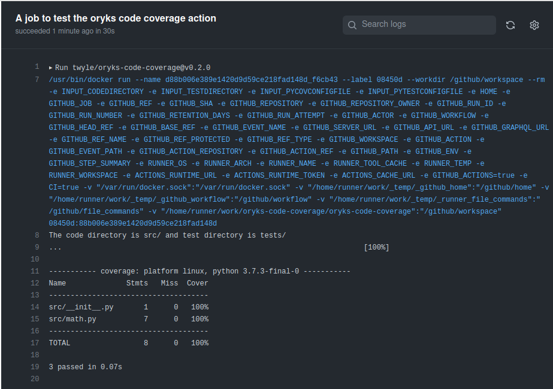

# oryks-code-coverage

> This GitHub Action shows Code Coverage for a given project.

[![security: bandit][bandit-image]][bandit-url]
[![Imports: isort][isort-image]][isort-url]
[](https://www.python.org/)
[](https://github.com/Naereen/StrapDown.js/blob/master/LICENSE)


This GitHub Action shows code Coverage for a given python project using Pytest Coverage. To use this action, your project must have tests written using pytest and stored in a test folder.



## Inputs

## `codedirectory`

**Required** The directory containing the source code. Default `"."`.

## `testdirectory`

**Required** The directory containing the tests. Default `"tests\"`.

## `pycovconfigfile`

**Optional** The pycov configuration file Default `".coveragerc"`.

## `pytestconfigfile`

**Optional** The pytest configuration file. Default `"setup.cfg"`.

## Outputs

## `testcoverage`

The Test coverage

## Example usage
```
- name: oryks code coverage action
  id: selftest
  uses: twyle/oryks-code-coverage@v1.0.0
  with:
    codedirectory: src/
    testdirectory: tests/

- name: action output
  run: |
    echo "${{ steps.selftest.outputs.testcoverage }}
```
